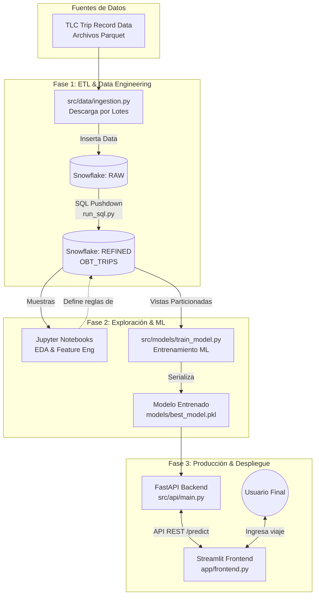

# Proyecto Final: Predicción de Tarifas de Taxi en NYC (End-to-End ML)

Este proyecto implementa una solución completa de Machine Learning (End-to-End) diseñada para manejar grandes volúmenes de datos (Big Data). A través de un enfoque de **Pushdown Computation** con Snowflake, el sistema procesa más de 10 años históricos de viajes de taxis amarillos y verdes en la ciudad de Nueva York (~20GB de datos brutos) para predecir el monto total del viaje (`TOTAL_AMOUNT`) con alta precisión.

El modelo subyacente seleccionado automáticamente entre múltiples algoritmos de Gradient Boosting (LightGBM, XGBoost, CatBoost) se despliega mediante una arquitectura moderna de microservicios usando **FastAPI** (Backend) y **Streamlit** (Frontend).

---

## 🏗 Arquitectura y Fases del Proyecto



El proyecto está dividido estrictamente en 5 fases metodológicas:

### 1. Ingesta de Datos a Snowflake (ETL)
Para no saturar la memoria RAM local con 20GB de información, la extracción de datos se hace mediante **lotes (chunks)**. El script de Python descarga los archivos Parquet mes a mes, unifica la estructura de columnas de taxis verdes y amarillos y sube los datos a la capa *RAW* de Snowflake.

### 2. Preparación y Exploración de Datos (SQL Pushdown + Notebooks)
La limpieza masiva de datos (filtrado de tarifas negativas, distancias irreales, outliers como viajes de $180,000 USD y velocidades absurdas) se traslada directamente al motor de la base de datos de Snowflake. Los cuadernos de Jupyter se utilizan para:
*   **EDA (Exploratory Data Analysis):** Análisis estadísticos sobre muestras del 1% al 5%.
*   **Limpieza Refinada:** Validaciones de Data Leakage (exclusión de duración, propinas y hora de bajada).
*   **Feature Engineering:** Creación de pipelines, cruce espacial e ingeniería temporal.

### 3. Modelado y Entrenamiento (Machine Learning)
En la carpeta `src/models/`, el script `train_model.py` recupera las vistas de Snowflake pre-divididas temporalmente:
*   **Train Set:** 2015 - 2023
*   **Validation Set:** 2024
*   **Test Set:** 2025

Se entrenan modelos base (Dummy, Bagging, Voting) y ensambles avanzados (XGBoost, LightGBM, CatBoost), aplicando métricas de validación para seleccionar automáticamente el ganador en base a la raíz del error cuadrático medio (RMSE).

### 4. Evaluación y Persistencia
El modelo ganador, junto con todo el preprocesador estructurado (Pipelines de Escalamiento y OneHotEncoding), se serializa en un archivo binario `.pkl` dentro del directorio `models/` listo para su puesta en producción.

### 5. Despliegue de Interfaz (Frontend & Backend API)
La capa productiva cuenta con:
*   **FastAPI:** Un servicio web robusto que expone un endpoint `/predict` capaz de recibir datos de un nuevo viaje y devolver la tarifa predicha al instante.
*   **Streamlit:** Una interfaz de usuario interactiva y amigable que consume el backend de FastAPI, con selecciones dinámicas en lenguaje humano y mapeos de códigos desde archivos `.csv`.

---

## 🚀 Cómo correr el proyecto completo (Paso a Paso)

Sigue estas instrucciones estrictamente en orden para ejecutar la solución desde cero:

### Prerrequisitos
1. Asegúrate de tener Python 3.10 o superior instalado.
2. Crea un archivo `.env` en la raíz del proyecto con tus credenciales de base de datos.
    ```env
    SNOWFLAKE_USER=tu_usuario
    SNOWFLAKE_PASSWORD=tu_password
    SNOWFLAKE_ACCOUNT=tu_cuenta
    SNOWFLAKE_WAREHOUSE=COMPUTE_WH
    SNOWFLAKE_DATABASE=ANALYTICS
    SNOWFLAKE_SCHEMA_RAW=RAW
    SNOWFLAKE_ROLE=ACCOUNTADMIN
    ```
3. Instala todas las dependencias del proyecto:
    ```powershell
    pip install -r requirements.txt
    ```

### Paso 1: Configurar la Base de Datos
Antes de descargar los datos, necesitamos configurar los esquemas y las tablas vacías en Snowflake:
```powershell
python scratch/run_sql.py
```
*Este comando crea la BD `ANALYTICS`, el esquema `RAW` y las vistas pre-particionadas en `REFINED`.*

### Paso 2: Ingesta Masiva de Datos
Arranca el motor de descarga y subida por bloques hacia la nube. Esto descargará cada mes desde 2015 a 2025 de los repositorios de TLC y los escribirá en tu Snowflake:
```powershell
python src/data/ingestion.py
```
*(Nota: Este paso puede demorar entre varios minutos u horas dependiendo del internet)*

### Paso 3: Exploración y Feature Engineering (Opcional)
Si deseas entender el análisis matemático y las reglas de diseño, puedes explorar e ir corriendo celda por celda la carpeta de `notebooks/`. Esto te explicará cómo decidimos eliminar ciertas variables para evitar fugas de datos (Leakage) y cómo armamos los transformadores.

### Paso 4: Entrenamiento del Modelo
Una vez que Snowflake tenga la Data y la tabla unificada (`OBT_TRIPS`) esté lista, ejecuta el entrenamiento. El script evalúa XGBoost, LightGBM, CatBoost y otros, y guarda el mejor:
```powershell
python -m src.models.train_model
```
*Al finalizar, aparecerá un archivo `.pkl` dentro de la carpeta `models/` y verás el RMSE final.*

### Paso 5: Despliegue de los Servicios (API & Frontend)
Abre dos terminales diferentes en tu entorno para lanzar ambos servidores simultáneamente.

**Terminal 1 (Backend - FastAPI):**
```powershell
uvicorn src.api.main:app --reload
```
*La API estará escuchando en `http://127.0.0.1:8000`.*

**Terminal 2 (Frontend - Streamlit):**
```powershell
streamlit run app/frontend.py
```
*Se abrirá automáticamente una pestaña en tu navegador web en `http://localhost:8501`. Desde aquí, puedes introducir los parámetros de un viaje (Distancia, Pasajeros, Zonas origen/destino) y obtener la tarifa estimada en tiempo real.*
